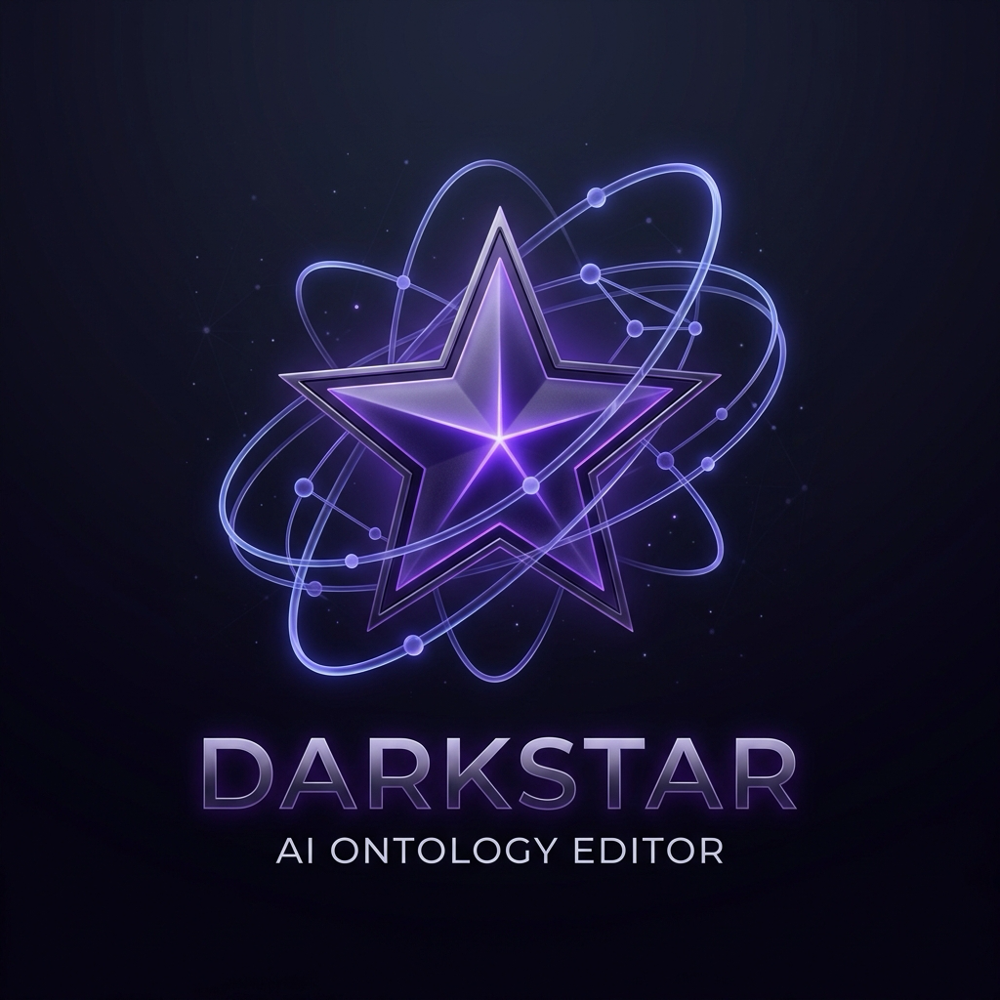

# Darkstar: Professional OWL 2 RL Ontology Editor

Darkstar is a high-performance, professional-grade ontology editor and inference engine built with Rust. It provides a visual and intuitive way to manage complex OWL 2 RL ontologies with real-time reasoning and dynamic graph visualization.



## Key Features

- **OWL 2 RL Compliance**: Full support for OWL 2 RL inference rules, including property chains, class expressions, and consistency checking.
- **Real-time Reasoning**: Automatic incremental reasoning as you edit your ontology.
- **Dynamic Graph Visualization**: Interactive, force-directed graph view with multiple layout modes (Hierarchical, Radial).
- **Bilingual Support**: Full dynamic support for English and Korean (한국어) languages.
- **Cross-Platform**: Built with Rust and `egui` for a native experience on macOS and Windows.
- **Visual Editing**: Manage classes, properties, and individuals through a modern, docked UI.

## Tech Stack

- **Core**: [Rust](https://www.rust-lang.org/)
- **UI Framework**: [egui](https://github.com/emilk/egui) / [eframe](https://github.com/emilk/egui/tree/master/crates/eframe)
- **RDF/Ontology**: [Sophia](https://github.com/pchampin/sophia_rs)
- **Parallelism**: [Rayon](https://github.com/rayon-rs/rayon)

## Getting Started

### Prerequisites

- [Rust](https://www.rust-lang.org/tools/install) (latest stable version)

### Build and Run

```bash
# Clone the repository
git clone https://github.com/tsarkr/darkstar.git
cd darkstar

# Run in development mode
cargo run --release
```

### Packaging

To package the application for your OS (macOS/Windows):

```bash
./package.sh
```

## License

This project is licensed under the MIT License - see the LICENSE file for details.

## Authors

- **Darkstar Team** - *Professional OWL 2 RL Ontology Editor*
