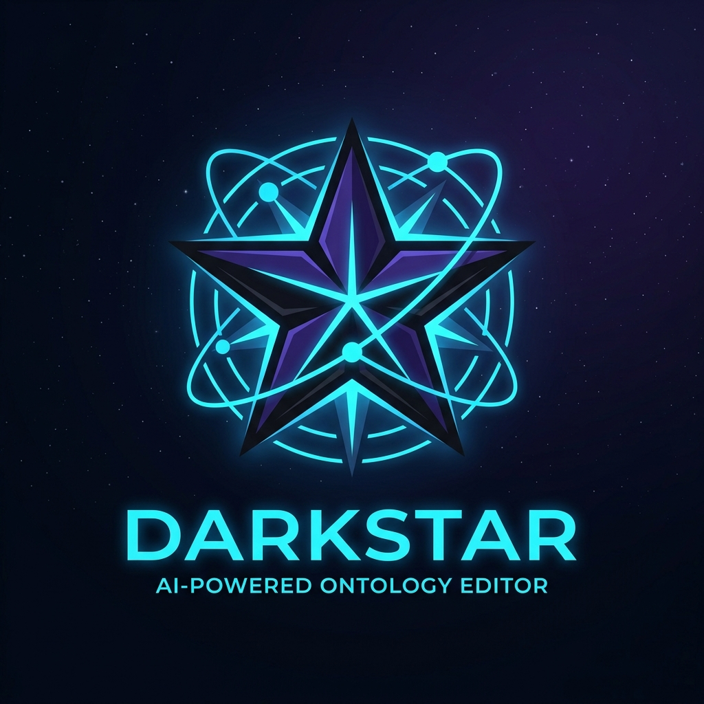

# Darkstar: Professional OWL 2 RL Ontology Editor

<p align="center">
  
</p>

Darkstar is a high-performance, professional-grade ontology editor and inference engine built with Rust. It provides a visual and intuitive way to manage complex OWL 2 RL ontologies with real-time reasoning and state-of-the-art graph visualization.

[English](#english) | [한국어](#한국어)

---

<a name="english"></a>
## English

### Key Features

- **Professional Reasoning Engine**: Full OWL 2 RL compliance with high-performance parallel forward-chaining using [Rayon](https://github.com/rayon-rs/rayon).
- **State-of-the-Art Graph Visualization**: 
    - Interactive graph view with multiple layouts (Force-Directed, Hierarchical, Radial, Circular, Concentric, and Grid).
    - **Layered Rendering**: Smart Z-index management ensuring labels never get obscured by lines.
    - **Collision Avoidance**: Edge labels are dynamically placed to avoid overlapping with nodes.
    - **Transparent Aesthetics**: Clean, background-free labels for a modern, premium look.
- **Multi-Tab Docking UI**: Powerful workspace management allowing you to dock and arrange Classes, Individuals, Graph, and Editor windows as you like.
- **Advanced Search System**: Real-time filtering for lists and instant visual highlighting for nodes in the graph.
- **Comprehensive Entity Editor**: Direct management of asserted and inferred triples, including a "Incoming Relations" view for full traceability.
- **Modern User Experience**: 
    - Stunning **Splash Screen** and card-style **Onboarding Wizard**.
    - Fully localized in **English and Korean**.
    - **Settings Persistence**: Theme, UI scale, and language settings are automatically saved and restored.
    - **System Clipboard Integration** for seamless URI copying.
- **Data Integrity**: Automated ontology metrics, consistency checking, and safety confirmation modals.

### Tech Stack

- **Core**: [Rust](https://www.rust-lang.org/)
- **UI Framework**: [egui](https://github.com/emilk/egui) / [egui_dock](https://github.com/Adanos020/egui_dock)
- **RDF/Ontology**: [Sophia](https://github.com/pchampin/sophia_rs)
- **Image Processing**: [egui_extras](https://github.com/emilk/egui/tree/master/crates/egui_extras) with image loaders.

---

<a name="한국어"></a>
## 한국어

### 주요 기능

- **전문가용 추론 엔진**: [Rayon](https://github.com/rayon-rs/rayon)을 이용한 고성능 병렬 전방 추론(Forward-Chaining)으로 OWL 2 RL 규칙을 완벽하게 지원합니다.
- **차세대 그래프 시각화**:
    - 다양한 레이아웃(힘 지향, 계층형, 방사형 등)을 지원하는 강력한 인터페이스.
    - **레이어 기반 렌더링**: 엣지, 노드, 라벨의 렌더링 순서를 제어하여 시각적 중첩 문제를 해결했습니다.
    - **충돌 방지 로직**: 관계 라벨이 노드와 겹치지 않도록 지능적으로 배치됩니다.
    - **투명도 최적화**: 배경 박스 없는 투명한 라벨로 프리미엄한 시각적 경험을 제공합니다.
- **멀티탭 도킹 UI**: 클래스, 개체, 그래프, 편집기 창을 사용자가 원하는 위치에 자유롭게 배치하고 관리할 수 있습니다.
- **강력한 검색 시스템**: 목록 실시간 필터링은 물론, 검색된 노드를 그래프상에서 즉시 강조(Highlight)합니다.
- **통합 엔티티 편집기**: 명시적/추론적 트리플의 직접 관리 및 "역방향 참조" 뷰를 통한 완벽한 추적성을 제공합니다.
- **현대적인 사용자 경험**:
    - 세련된 **스플래시 화면**과 카드 스타일의 **초기 설정 위저드**.
    - **영어 및 한국어** 완전 지원 및 실시간 전환.
    - **환경설정 영속성**: 테마, UI 배율, 언어 설정이 자동으로 저장되고 복원됩니다.
    - **시스템 클립보드 연동**을 통한 원활한 데이터 이동.
- **데이터 무결성**: 자동 온톨로지 통계, 일관성 검사 및 안전 확인 모달을 통한 데이터 보호.

### 기술 스택

- **핵심 언어**: [Rust](https://www.rust-lang.org/)
- **UI 프레임워크**: [egui](https://github.com/emilk/egui) / [egui_dock](https://github.com/Adanos020/egui_dock)
- **RDF/온톨로지**: [Sophia](https://github.com/pchampin/sophia_rs)
- **이미지 처리**: `egui_extras` (image feature)

---

## Getting Started / 시작하기

### Prerequisites / 사전 요구사항

- [Rust](https://www.rust-lang.org/tools/install) (latest stable version)

### Build and Run / 빌드 및 실행

```bash
# 저장소 클론
git clone https://github.com/tsarkr/darkstar.git
cd darkstar

# 실행 (최초 실행 시 온보딩 위저드가 나타납니다)
cargo run --release
```

### Packaging / 패키징

운영체제(macOS/Windows)에 맞는 설치 파일을 만들려면 아래 스크립트를 실행하세요:

```bash
./package.sh
```

## License / 라이선스

TBD (To Be Determined) / 미정

## Authors / 작성자

- **Gyungmin** (@tsarkr)
